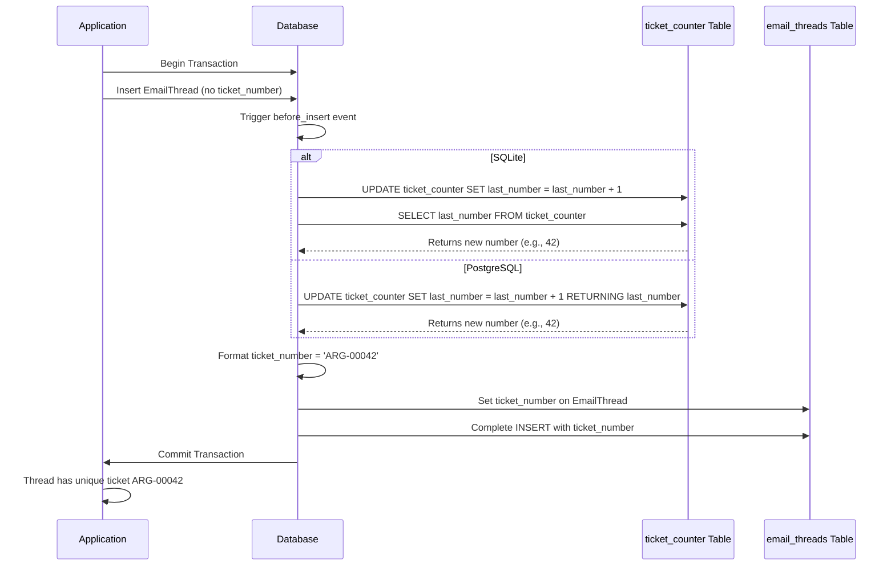

# System Flow Diagram

## Complete Email Processing Flow

```mermaid
graph TD
    A[Email Arrives in IONOS Inbox] --> B{Check Subject for Ticket Number}
    
    B -->|Has [ARG-XXXXX]| C[Find Existing Thread]
    B -->|No Ticket Number| D[Create New Thread]
    
    C --> E[Add to Thread]
    E --> F[Update Thread Status]
    F --> G[Store in Database]
    
    D --> H[AI Processing Pipeline]
    H --> I[Extract Information<br/>- Staff Name<br/>- Query Type<br/>- Urgency Level]
    H --> J[Generate Summary<br/>- Executive Summary<br/>- Key Points<br/>- Action Items]
    H --> K[Create Suggested Response]
    
    I --> L[Create EmailThread Record]
    J --> L
    K --> L
    
    L --> M[Database Auto-Generates<br/>Ticket Number]
    M --> N[ARG-00001, ARG-00002, etc.]
    
    N --> O[Create EmailMessage Record]
    O --> P[Store Attachments]
    
    G --> Q[Available in Dashboard]
    P --> Q
    
    Q --> R[HR Staff Actions]
    R --> S[Review Suggested Response]
    R --> T[Edit/Compose Reply]
    R --> U[Route to Ops Manager]
    
    T --> V[Send Reply]
    V --> W[Add Ticket to Subject:<br/>[ARG-00001] Original Subject]
    W --> X[Email Sent via SMTP]
    
    style A fill:#e1f5fe
    style H fill:#fff3e0
    style M fill:#c8e6c9
    style Q fill:#f3e5f5
```

## Database Ticket Generation Detail



## Key Points

1. **Email Detection**: System checks every 60 seconds for new emails
2. **Thread Matching**: Uses regex to find `[ARG-XXXXX]` pattern in subject
3. **AI Processing**: Only for new threads (not replies to existing)
4. **Database Generation**: Ticket numbers created atomically by database
5. **No Duplicates**: Database constraints ensure uniqueness
6. **Sequential**: Numbers always increment (never reused)
7. **Thread Linking**: All future emails with ticket in subject link to same thread 