# High Level Design - Argan HR Email Management System Backend

## Architecture Overview

```mermaid
graph TD
    A["📧 SendGrid Webhook<br/>POST /webhook/inbound"] --> B["🚀 FastAPI Server<br/>(server.py)"]
    
    B --> C["📦 Main Orchestrator<br/>(main.py)"]
    
    C --> D["🔍 Multipart Parser<br/>(utils.py)"]
    D --> E["📝 Context Object Creation"]
    
    E --> F["🚫 Deduplication Check<br/>(Message-ID validation)"]
    F --> G{"Already Processed?"}
    G -->|Yes| H["⏹️ Skip Processing"]
    G -->|No| I["🤖 AI Classification<br/>(ai_agents.py)"]
    
    I --> J["🧠 TicketClassificationAgent<br/>(OpenAI GPT-4.1)"]
    J --> K{"Ticket Number<br/>in Subject?"}
    
    K -->|No| L["🆕 NEW_EMAIL Path"]
    K -->|Yes| M["💬 EXISTING_EMAIL Path"]
    
    L --> N["🎫 Generate Ticket Number<br/>(ARG-YYYYMMDD-NNNN)"]
    N --> O["🤖 Extract Sender Info<br/>(AI name/care home extraction)"]
    O --> P["💾 Store in Airtable<br/>(database.py)"]
    P --> Q["📤 Send Auto-Reply<br/>(email_service.py)"]
    Q --> R["✅ Update Auto-Reply Status"]
    
    M --> S["🔍 Auto-Reply Detection<br/>(Domain/content analysis)"]
    S --> T{"Our Auto-Reply<br/>Bouncing Back?"}
    T -->|Yes| U["⏹️ Ignore Safely"]
    T -->|No| V["📋 Retrieve Existing Record"]
    
    V --> W["🧵 Conversation Parsing<br/>(ConversationParsingAgent1)"]
    W --> X{"Existing Conversation<br/>History?"}
    X -->|No| Y["💾 Update with New History"]
    X -->|Yes| Z["🔄 Merge & Deduplicate<br/>(ConversationParsingAgent2)"]
    Z --> AA["💾 Update Merged History"]
    
    subgraph "🔧 External Dependencies"
        BB["📨 SendGrid API<br/>(Email sending)"]
        CC["🧠 OpenAI API<br/>(GPT-4.1)"]
        DD["🗄️ Airtable API<br/>(Data storage)"]
    end
    
    subgraph "📊 Data Models"
        EE["📧 EmailContext<br/>(models/email_context.py)"]
        FF["🎫 TicketClassificationResponse"]
        GG["💬 ConversationEntry"]
    end
    
    subgraph "🛠️ Core Components"
        HH["📧 Email Service<br/>(SendGrid integration)"]
        II["🗄️ Database Layer<br/>(Airtable operations)"]
        JJ["🤖 AI Agents<br/>(Classification & parsing)"]
        KK["🔧 Utilities<br/>(Parsing, validation)"]
    end
    
    Q --> BB
    J --> CC
    P --> DD
    V --> DD
    Y --> DD
    AA --> DD
```



## System Architecture

The backend follows a **layered microservice architecture** with clear separation of concerns:

### 🏗️ **1. Presentation Layer**
- **FastAPI Server** (`server.py`) - REST API endpoint for SendGrid webhooks
- **Request Validation** - UTF-8 error handling and multipart parsing

### 🎯 **2. Orchestration Layer** 
- **Main Orchestrator** (`main.py`) - Central processing hub
- **Email Validator** (`validator.py`) - AI-powered email classification
- **Path Router** - Routes emails to appropriate processing pipelines

### 💼 **3. Business Logic Layer**
- **New Email Handler** - Ticket generation, storage, auto-reply
- **Existing Email Handler** (`existing_email_handler.py`) - Conversation management
- **AI Agents** (`ai_agents.py`) - OpenAI-powered classification and parsing

### 🔧 **4. Service Layer**
- **Email Service** (`email_service.py`) - SendGrid integration
- **Database Service** (`database.py`) - Airtable operations
- **Utility Services** (`utils.py`) - Helper functions

### 🗄️ **5. Data Layer**
- **Airtable Database** - Persistent storage
- **In-Memory Cache** - Deduplication tracking

---

## Processing Flows

### 🆕 **NEW_EMAIL Flow:**
1. Generate unique ticket number (ARG-YYYYMMDD-NNNN format)
2. AI extracts sender name/care home from email content
3. Store initial inquiry in Airtable with conversation history
4. Send personalized auto-reply with ticket number
5. Update auto-reply status in database

### 💬 **EXISTING_EMAIL Flow:**
1. Detect auto-reply bounces vs genuine customer responses
2. Retrieve existing ticket record from Airtable
3. Parse conversation thread using AI Agent 1
4. Check for existing conversation history
5. If history exists: Merge with new entries using AI Agent 2
6. Update conversation history in database

---

## AI Components

| Agent | Purpose | Model | Input | Output |
|-------|---------|-------|--------|--------|
| **TicketClassificationAgent** | Detect ticket numbers in email subjects | GPT-4.1 | Email subject | NEW_EMAIL vs EXISTING_EMAIL path |
| **ConversationParsingAgent1** | Parse email threads into structured entries | GPT-4.1 | Raw email content | JSON array of conversation entries |
| **ConversationParsingAgent2** | Merge and deduplicate conversations | GPT-4.1 | New + existing JSON | Merged JSON with duplicates removed |
| **SenderNameExtractor** | Extract sender names from email content | GPT-4.1 | Email body text | First name, last name, confidence |
| **CareHomeNameExtractor** | Extract care home names from content | GPT-4.1 | Email body text | Care home name |

---

## Security & Reliability Features

### 🔐 **Security**
- **Input Validation** - Pydantic models with strict typing
- **UTF-8 Handling** - Robust encoding error management for email content
- **Deduplication** - Message-ID based duplicate email prevention
- **Rate Limiting** - Built-in SendGrid API limits and retry logic

### 🛡️ **Reliability**
- **Retry Logic** - Exponential backoff for external API calls
- **Error Handling** - Graceful degradation with fallback responses
- **Race Condition Protection** - Immediate processing locks for concurrent emails
- **Structured Logging** - Comprehensive debugging and monitoring

### 📊 **Monitoring**
- **Processing Status Tracking** - Each email marked with processing state
- **AI Confidence Scores** - Classification reliability metrics
- **Auto-Reply Status** - Success/failure tracking for customer communications

---

## Data Models

### 📧 **EmailContext**
```python
@dataclass
class EmailContext:
    subject: str
    text: str
    from_field: str
    to: str
    headers: str
    received_timestamp: str
    # ... additional technical fields
```

### 🎫 **TicketClassificationResponse**
```python
class TicketClassificationResponse(BaseModel):
    ticket_number_present_in_subject: bool
    path: EmailPath  # NEW_EMAIL | EXISTING_EMAIL
    confidence_score: float
    ticket_number_found: Optional[str]
    analysis_notes: Optional[str]
```

### 💬 **ConversationEntry**
```python
class ConversationEntry(BaseModel):
    sender_email: str
    sender_name: str
    sender_email_date: str
    sender_content: str
    chronological_order: int
```

---

## Technology Stack

### 🐍 **Backend Framework**
- **FastAPI** - Modern, fast web framework for building APIs
- **Uvicorn** - ASGI server implementation
- **Pydantic** - Data validation using Python type annotations

### 🤖 **AI & Machine Learning**
- **OpenAI GPT-4.1** - Large language model for text processing
- **Structured Outputs** - Guaranteed JSON schema compliance

### 🔗 **External Integrations**
- **SendGrid API** - Email delivery and webhook processing
- **Airtable API** - Database operations and data storage
- **PyAirtable** - Python client for Airtable operations

### 📊 **Data Processing**
- **JSON** - Structured data exchange format
- **Multipart Form Data** - Email content parsing
- **RegEx** - Pattern matching for fallback operations

---

## API Endpoints

### 📨 **Webhook Endpoints**
- `POST /webhook/inbound` - SendGrid inbound email webhook
- `GET /` - Health check and service information
- `GET /health` - Simple health status

---

## File Structure

```
backend2/
├── main.py                     # Central orchestrator
├── server.py                   # FastAPI application
├── validator.py                # Email classification
├── ai_agents.py               # OpenAI integration
├── database.py                # Airtable operations
├── email_service.py           # SendGrid integration
├── auto_reply_templates.py    # Email template generation
├── utils.py                   # Utility functions
├── models/
│   └── email_context.py       # Data models
├── email_functions/
│   └── existing_email/
│       └── existing_email_handler.py  # Existing email processing
└── docs/
    └── HIGH_LEVEL_DESIGN.md   # This document
```

---

## Environment Variables

| Variable | Purpose | Example |
|----------|---------|---------|
| `OPENAI_API_KEY` | OpenAI API authentication | `sk-...` |
| `SENDGRID_API_KEY` | SendGrid API authentication | `SG.xyz...` |
| `FROM_EMAIL` | Auto-reply sender address | `email@email.adaptixinnovation.co.uk` |
| `AIRTABLE_API_KEY` | Airtable API authentication | `pat...` |
| `AIRTABLE_BASE_ID` | Airtable database identifier | `app...` |

---

## Performance Characteristics

### 📈 **Throughput**
- **Concurrent Processing** - Async/await pattern for high concurrency
- **Deduplication** - Prevents redundant processing of duplicate emails
- **Race Condition Protection** - Immediate processing locks

### ⏱️ **Latency**
- **AI Processing** - 2-5 seconds per email (OpenAI API dependent)
- **Database Operations** - < 1 second (Airtable API dependent)
- **Email Sending** - < 1 second (SendGrid API dependent)

### 🔄 **Reliability**
- **Retry Logic** - 3 attempts with exponential backoff
- **Graceful Degradation** - Fallback responses when AI fails
- **Error Recovery** - Comprehensive exception handling 