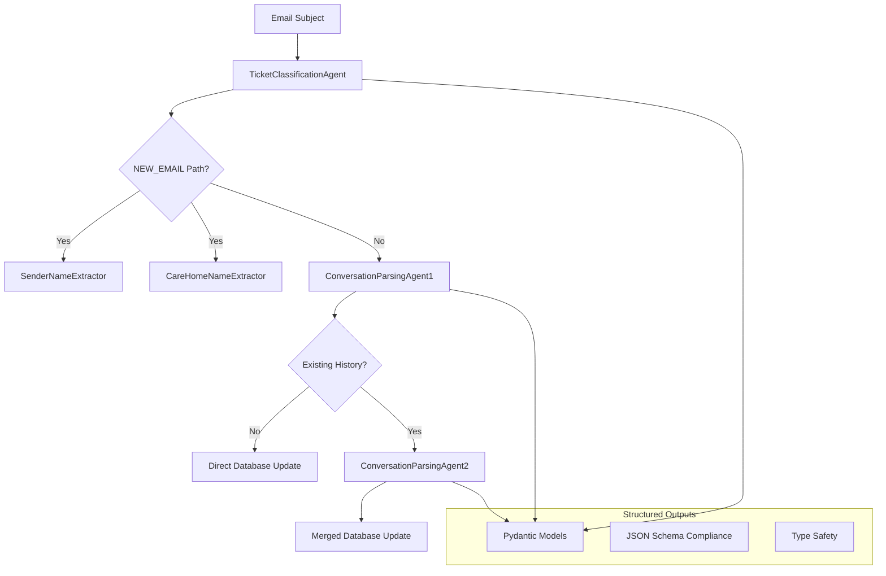

# Low-Level Design - AI Pipeline

## Overview

The **AI Pipeline** orchestrates multiple specialized AI agents using OpenAI GPT-4.1 to handle email classification, conversation parsing, and data extraction. Each agent is designed for specific tasks with structured outputs and robust error handling.

## AI Agent Architecture

### 1. Base AI Agent (`ai_agents.py`)

#### **BaseAIAgent Class**
```python
class BaseAIAgent(ABC):
    def __init__(self, model: str = "gpt-4.1"):
        self.client = OpenAI(api_key=os.getenv("OPENAI_API_KEY"))
        self.model = model
    
    @abstractmethod
    def _build_system_prompt(self) -> str:
        pass
    
    @abstractmethod
    async def process(self, input_data: Dict[str, Any]) -> Any:
        pass
```

**Common Features:**
- OpenAI client initialization with API key management
- Standardized error handling and logging
- Structured output parsing using Pydantic models
- Abstract base class ensuring consistent implementation

### 2. Ticket Classification Agent

#### **Purpose:** Email subject analysis for ticket number detection
```python
class TicketClassificationAgent(BaseAIAgent):
    def __init__(self):
        super().__init__()
        self.ticket_pattern = "ARG-YYYYMMDD-NNNN"
```

**Input:** Email subject line
**Output:** `TicketClassificationResponse` with path determination

**System Prompt Strategy:**
- Pattern recognition for Argan ticket format (ARG-YYYYMMDD-NNNN)
- Context-aware analysis of email prefixes ("Re:", "Fwd:", etc.)
- Case-insensitive matching with formatting tolerance
- Confidence scoring for classification reliability

**Processing Logic:**
1. Analyze subject line for ticket number patterns
2. Handle various email client formatting variations
3. Return structured classification with confidence score
4. Fallback to regex pattern matching on AI failure

### 3. Conversation Parsing Agents

#### **ConversationParsingAgent1**
**Purpose:** Parse raw email content into structured conversation entries

```python
class ConversationParsingAgent1(BaseAIAgent):
    def _build_system_prompt(self) -> str:
        return """Context: You are an ai agent employed by a HR consultancy company called Argan HR Consultancy.
        
        Task: You will be passed the email forwarded into our system. Extract the conversation entries 
        (always ignoring the source of truth query) and produce a structured output as per the response 
        output json schema."""
```

**Capabilities:**
- Multi-format email client support (Outlook, Gmail, Apple Mail)
- Chronological ordering with date fallback logic
- Sender identification and name extraction
- Content cleaning and formatting

#### **ConversationParsingAgent2**
**Purpose:** Merge and deduplicate conversation histories

```python
class ConversationParsingAgent2(BaseAIAgent):
    def _build_system_prompt(self) -> str:
        return """Context: A previous agent (Agent 1) has parsed all the conversation entries in an email thread.
        
        Task: Your task is to analyse both JSON (the existing JSON and the new JSON), remove any duplicate 
        conversation entries and create a single final JSON in chronological order."""
```

**Merge Logic:**
- Duplicate detection using content similarity and timestamps
- Chronological reordering of combined entries
- Conflict resolution for overlapping information
- Source of truth prioritization (NEW JSON over EXISTING JSON)

### 4. Data Extraction Agents

#### **SenderNameExtractor**
**Purpose:** Extract sender names from email signatures and content

```python
class SenderNameExtractor:
    def extract_sender_name(self, email_content: str) -> SenderNameExtractionResponse
```

**Detection Strategy:**
- Signature pattern recognition ("Best regards,", "Sincerely,", "Thanks,")
- Name component separation (first name, last name)
- Confidence scoring based on signature clarity
- Email username fallback for missing signatures

#### **CareHomeNameExtractor**
**Purpose:** Identify care home names from email context

```python
class CareHomeNameExtractor:
    def extract_care_home_name(self, email_content: str) -> CareHomeNameExtractionResponse
```

**Analysis Approach:**
- Message content analysis for care home mentions
- Email signature parsing for workplace indicators
- Pattern recognition for care facility naming conventions
- Context-aware extraction from sender information

## Data Models & Structured Outputs

### **Pydantic Models for Type Safety**

#### **TicketClassificationResponse**
```python
class TicketClassificationResponse(BaseModel):
    ticket_number_present_in_subject: bool
    path: EmailPath  # NEW_EMAIL | EXISTING_EMAIL
    confidence_score: float
    ticket_number_found: Optional[str] = None
    analysis_notes: Optional[str] = None
```

#### **ConversationEntry**
```python
class ConversationEntry(BaseModel):
    sender_email: str
    sender_name: str
    sender_email_date: str = Field(
        description="Date and time in DD/MM/YYYY HH:MM BST format",
        examples=["03/06/2025 17:37 BST"]
    )
    sender_content: str
    chronological_order: int
```

#### **SenderNameExtractionResponse**
```python
class SenderNameExtractionResponse(BaseModel):
    sender_name: Optional[str] = None
    sender_first_name: Optional[str] = None
    sender_last_name: Optional[str] = None
    confidence: float = 0.0
    notes: Optional[str] = None
```

## AI Processing Flow

### **Agent Interaction Chain**



### **Error Handling & Fallbacks**

#### **API Failure Recovery**
```python
# Primary: OpenAI structured analysis
try:
    response = self.client.responses.parse(model=self.model, ...)
    return response.output_parsed
except Exception as e:
    # Secondary: Regex fallback
    return self._create_fallback_response(input_data, str(e))
```

#### **Fallback Strategies by Agent**
- **Classification:** Regex pattern matching for ticket numbers
- **Name Extraction:** Email username parsing as fallback
- **Conversation Parsing:** Empty array return with error logging
- **Care Home Extraction:** Empty string return with graceful handling

## Performance Characteristics

### **Response Times**
- **Ticket Classification:** 1-3 seconds (subject line analysis)
- **Conversation Parsing:** 3-8 seconds (content dependent)
- **Name Extraction:** 2-4 seconds (signature analysis)
- **Care Home Extraction:** 2-4 seconds (content analysis)

### **Accuracy Metrics**
- **Ticket Classification:** >99% with fallback regex
- **Conversation Parsing:** >95% with structured outputs
- **Name Extraction:** >90% for clear signatures
- **Care Home Detection:** >85% for explicit mentions

### **Rate Limiting & Throttling**
- **OpenAI API Limits:** Tier-dependent request limits
- **Concurrent Processing:** Limited by API quotas
- **Retry Logic:** Exponential backoff for rate limit errors
- **Cost Optimization:** Efficient prompt design to minimize tokens

## Configuration & Optimization

### **Model Parameters**
```python
MODEL_CONFIG = {
    "model": "gpt-4.1",
    "temperature": 0.1,  # Low for consistent outputs
    "max_tokens": 4000,
    "timeout": 30.0
}
```

### **Prompt Engineering Best Practices**
- **Clear Role Definition:** Specific agent purpose and expertise
- **Structured Instructions:** Step-by-step processing guidelines
- **Example Formats:** Sample inputs/outputs for consistency
- **Error Handling:** Guidance for edge cases and fallbacks

### **Cost Management**
- **Token Optimization:** Concise prompts with essential context
- **Caching Strategy:** Avoid redundant API calls
- **Batch Processing:** Group similar operations when possible
- **Model Selection:** Use appropriate model tier for task complexity

## Monitoring & Analytics

### **Key Metrics**
- AI agent success/failure rates by type
- Average processing time per agent
- Token usage and cost tracking
- Confidence score distributions
- Fallback activation frequency

### **Error Tracking**
- API timeout and rate limit errors
- JSON parsing failures in structured outputs
- Model response quality issues
- Prompt injection detection and prevention

### **Logging Strategy**
```python
logger.info(f"🤖 [AI AGENT] Initialized {self.__class__.__name__} with model {model}")
logger.info(f"🎫 [TICKET CLASSIFIER] Classification: {result.path}, Confidence: {result.confidence_score}")
logger.info(f"🧵 [CONVERSATION AI] Successfully parsed {len(conversation_array)} conversation entries")
logger.error(f"❌ [AI AGENT] Error during processing: {e}")
```

## Security Considerations

### **API Security**
- Environment-based API key management
- Request/response logging controls
- PII detection and sanitization
- Rate limiting and abuse prevention

### **Prompt Injection Protection**
- Input sanitization for email content
- System prompt isolation from user input
- Content filtering for malicious patterns
- Length limits on input data

### **Data Privacy**
- Email content anonymization in logs
- Structured output sanitization
- GDPR compliance for processed data
- Minimal data retention policies 