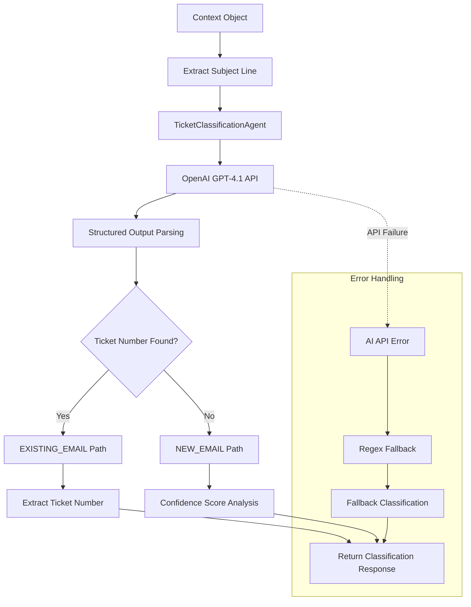

# Low-Level Design - Classification Pipeline

## Overview

The **Classification Pipeline** uses AI to analyze email subjects and determine the appropriate processing path. It distinguishes between new inquiries and replies to existing tickets using OpenAI GPT-4.1 with structured outputs.

## Components

### 1. Email Validator (`validator.py`)

#### **EmailValidator Class**
```python
class EmailValidator:
    def __init__(self):
        self.ticket_classifier = TicketClassificationAgent()
    
    async def classify_email_path(self, context_object: Dict[str, Any]) -> TicketClassificationResponse
```

**Responsibilities:**
- Extract subject from context object
- Route to AI classification agent
- Handle classification errors with fallbacks
- Return structured classification response

### 2. Ticket Classification Agent (`ai_agents.py`)

#### **TicketClassificationAgent Class**
```python
class TicketClassificationAgent(BaseAIAgent):
    def __init__(self):
        super().__init__()
        self.ticket_pattern = "ARG-YYYYMMDD-NNNN"  # e.g., ARG-20250531-0001
```

**AI Model Configuration:**
- **Model:** `gpt-4.1`
- **Input:** Email subject line
- **Output:** Structured `TicketClassificationResponse`
- **Pattern Recognition:** Argan ticket format detection

#### **System Prompt Design**
```python
def _build_system_prompt(self) -> str:
    return f"""# Argan HR Ticket Classification Agent

You are an expert email classifier for Argan Consultancy HR system. 
Your job is to analyze email subject lines to detect the presence of Argan ticket numbers.

## Argan Ticket Number Format
- Pattern: {self.ticket_pattern}
- Examples: ARG-20250531-0001, ARG-20241215-0123, ARG-20250603-0456
- May appear with prefixes like: "Re: ARG-20250531-0001", "[ARG-20250531-0001]"
- Case insensitive matching
- Core pattern is ARG-[8 digits]-[4 digits]

## Classification Rules
- **NEW_EMAIL**: Subject line does NOT contain any Argan ticket number
- **EXISTING_EMAIL**: Subject line DOES contain an Argan ticket number
"""
```

### 3. Response Models (`ai_agents.py`)

#### **TicketClassificationResponse**
```python
class TicketClassificationResponse(BaseModel):
    ticket_number_present_in_subject: bool
    path: EmailPath  # NEW_EMAIL | EXISTING_EMAIL
    confidence_score: float
    ticket_number_found: Optional[str] = None
    analysis_notes: Optional[str] = None
```

#### **EmailPath Enum**
```python
class EmailPath(str, Enum):
    NEW_EMAIL = "new_email"
    EXISTING_EMAIL = "existing_email"
```

## Algorithm Flow



## Classification Logic

### **Primary Detection Method: AI Analysis**

**Input Processing:**
```python
user_content = f"""
EMAIL SUBJECT TO ANALYZE:
"{subject}"

Please analyze this subject line for the presence of an Argan ticket number and classify accordingly.
"""
```

**AI Analysis Criteria:**
1. **Pattern Recognition:** ARG-YYYYMMDD-NNNN format detection
2. **Context Awareness:** "Re:", "[TICKET]", "Fwd:" prefix handling
3. **Case Insensitivity:** Upper/lowercase variation tolerance
4. **Formatting Variations:** Spaces, dashes, brackets around ticket numbers

### **Fallback Detection Method: Regex**

```python
def _create_fallback_response(self, subject: str, error_msg: str) -> TicketClassificationResponse:
    ticket_pattern = r'ARG-\d{8}-\d{4}'
    match = re.search(ticket_pattern, subject.upper())
    
    has_ticket = match is not None
    ticket_found = match.group(0) if match else None
    
    return TicketClassificationResponse(
        ticket_number_present_in_subject=has_ticket,
        path=EmailPath.EXISTING_EMAIL if has_ticket else EmailPath.NEW_EMAIL,
        confidence_score=0.8 if has_ticket else 0.7,
        ticket_number_found=ticket_found,
        analysis_notes=f"Fallback regex classification due to AI error: {error_msg}"
    )
```

## Data Structures

### **Input: Context Object**
```json
{
  "subject": "Re: [ARG-20250603-0001] Argan HR Consultancy - Call Logged",
  "from": "customer@company.com",
  "to": "advice@arganhrconsultancy.co.uk",
  "text": "Thank you for your response...",
  // ... other fields
}
```

### **Output: Classification Response**
```json
{
  "ticket_number_present_in_subject": true,
  "path": "existing_email",
  "confidence_score": 0.95,
  "ticket_number_found": "ARG-20250603-0001",
  "analysis_notes": "Clear ticket number pattern found in subject with Re: prefix"
}
```

## Performance Characteristics

### **AI Processing**
- **Latency:** 1-3 seconds per classification
- **Accuracy:** >99% with GPT-4.1 on ticket pattern recognition
- **Rate Limits:** OpenAI API limits (handled with retry logic)

### **Fallback Processing**
- **Latency:** <1ms for regex pattern matching
- **Accuracy:** ~95% for exact pattern matches
- **Reliability:** No external dependencies

### **Memory Usage**
- **Agent Instance:** ~1MB loaded model reference
- **Request Processing:** ~100 bytes per classification
- **Response Objects:** ~500 bytes per structured response

## Error Handling

### **OpenAI API Errors**

#### **Network Errors**
```python
except (httpx.ConnectTimeout, httpx.TimeoutException) as e:
    # Retry with exponential backoff
    # Fall back to regex if retries exhausted
```

#### **Rate Limiting**
```python
except OpenAIRateLimitError as e:
    # Wait and retry with longer delay
    # Use fallback classification if urgent
```

#### **Invalid Response Format**
```python
except ValidationError as e:
    # Log malformed response
    # Use regex fallback for classification
```

### **Fallback Strategy Priority**
1. **Primary:** OpenAI GPT-4.1 structured analysis
2. **Secondary:** Regex pattern matching with confidence scoring
3. **Tertiary:** Default to NEW_EMAIL path (safe assumption)

## Configuration

### **Environment Variables**
```bash
# OpenAI Configuration
OPENAI_API_KEY=sk-your-api-key
OPENAI_MODEL=gpt-4.1
OPENAI_MAX_TOKENS=1000
OPENAI_TIMEOUT=30

# Classification Settings
CLASSIFICATION_CONFIDENCE_THRESHOLD=0.7
FALLBACK_ENABLED=true
```

### **Model Parameters**
```python
response = self.client.responses.parse(
    model=self.model,  # gpt-4.1
    input=[
        {"role": "system", "content": self._build_system_prompt()},
        {"role": "user", "content": user_content}
    ],
    text_format=TicketClassificationResponse
)
```

## Monitoring & Analytics

### **Key Metrics**
- Classification accuracy rate
- AI vs fallback usage ratio
- Average classification latency
- Confidence score distribution
- Error rate by error type

### **Logging Strategy**
```python
logger.info(f"🎫 [TICKET CLASSIFIER] Analyzing subject: '{subject}'")
logger.info(f"🎫 [TICKET CLASSIFIER] Classification: {result.path}, Ticket found: {result.ticket_number_found}")
logger.info(f"🎫 [TICKET CLASSIFIER] Confidence: {result.confidence_score}")
```

### **Analytics Dashboard Fields**
- **Classification Volume:** Emails classified per hour/day
- **Path Distribution:** NEW_EMAIL vs EXISTING_EMAIL ratio
- **Confidence Trends:** Average confidence scores over time
- **Error Patterns:** Most common classification failures

## Testing Strategy

### **Unit Tests**

#### **AI Classification Tests**
```python
def test_ticket_number_detection():
    subjects = [
        "Re: [ARG-20250603-0001] Question about policy",
        "ARG-20250603-0001 - Follow up",
        "New inquiry about HR services",  # Should be NEW_EMAIL
        "FWD: ARG-20241215-0123 Additional info"
    ]
    # Test each subject against expected classification
```

#### **Fallback Tests**
```python
def test_regex_fallback():
    # Test regex pattern matching when AI fails
    # Verify confidence scoring in fallback mode
    # Test edge cases in ticket number formats
```

### **Integration Tests**
```python
def test_end_to_end_classification():
    # Full pipeline from context object to classification
    # Test with real email subjects from production
    # Verify structured output compliance
```

### **Performance Tests**
```python
def test_classification_latency():
    # Measure average response time under load
    # Test concurrent classification requests
    # Monitor memory usage during sustained operation
```

## Security Considerations

### **Input Sanitization**
- Subject line length limits (prevent prompt injection)
- Special character escaping in prompts
- Malicious pattern detection

### **API Security**
- OpenAI API key rotation
- Request/response logging controls
- PII detection in email subjects

### **Data Privacy**
- Email subject anonymization in logs
- Retention policies for classification data
- GDPR compliance for processed content 