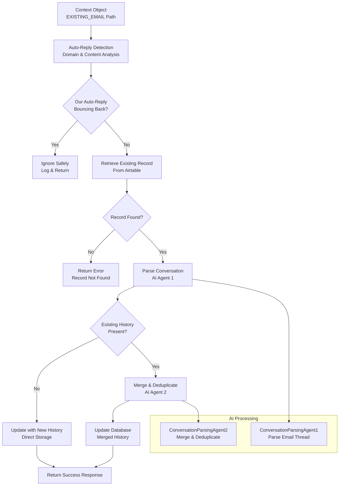

# Low-Level Design - Existing Email Pipeline

## Overview

The **Existing Email Pipeline** processes emails that contain existing ticket numbers in their subject lines. It handles auto-reply bounce detection, conversation thread parsing, history merging, and database updates while preventing infinite email loops.

## Pipeline Flow



## Core Components

### 1. Auto-Reply Detection
Prevents infinite loops by detecting our own auto-replies being forwarded back to the system.

### 2. Database Record Retrieval  
Fetches existing ticket records from Airtable using ticket number lookup.

### 3. AI Conversation Parsing
Uses ConversationParsingAgent1 to extract structured conversation entries from email threads.

### 4. History Merging
Uses ConversationParsingAgent2 to merge new conversations with existing history while removing duplicates.

### 5. Database Updates
Updates Airtable records with new conversation history and metadata.

## Data Structures

### **ConversationEntry Model**
```python
class ConversationEntry(BaseModel):
    sender_email: str
    sender_name: str
    sender_email_date: str = Field(
        description="Date and time when the sender's email was sent in DD/MM/YYYY HH:MM BST format",
        examples=["03/06/2025 17:37 BST", "15/12/2024 09:30 BST"]
    )
    sender_content: str
    chronological_order: int
```

### **Sample Conversation History JSON**
```json
[
  {
    "sender_email": "customer@company.com",
    "sender_name": "John Smith",
    "sender_email_date": "03/06/2025 17:37 BST",
    "sender_content": "Hi, I need help with HR policy regarding staff breaks...",
    "chronological_order": 1
  },
  {
    "sender_email": "hr.advisor@arganhrconsultancy.co.uk",
    "sender_name": "Sarah Jones",
    "sender_email_date": "04/06/2025 09:15 BST", 
    "sender_content": "Thank you for your inquiry. Based on current regulations...",
    "chronological_order": 2
  },
  {
    "sender_email": "customer@company.com",
    "sender_name": "John Smith",
    "sender_email_date": "04/06/2025 14:22 BST",
    "sender_content": "That's very helpful, but I have a follow-up question...",
    "chronological_order": 3
  }
]
```

## Processing Scenarios

### **Scenario 1: Auto-Reply Bounce Detection**
```python
# Input: Our auto-reply forwarded back to system
context.from_field = "email@email.adaptixinnovation.co.uk"
context.subject = "[ARG-20250603-0001] Argan HR Consultancy - Call Logged"
context.text = "Hi John,\n\nThank you for contacting Argan HR Consultancy..."

# Processing:
if detect_auto_reply_forward(context):
    return {"status": "ignored_auto_reply_bounce"}
```

### **Scenario 2: Customer Follow-Up**
```python
# Input: Customer reply to existing ticket
context.from_field = "John Smith <jsmith@company.com>"
context.subject = "Re: [ARG-20250603-0001] HR Policy Question"
context.text = "Thank you for your response. I have another question..."

# Processing:
existing_record = get_existing_record("ARG-20250603-0001")
new_entries = parse_conversation_thread(context.text, existing_record['fields']['conversation_history'])
update_existing_record("ARG-20250603-0001", new_entries, context.headers)
```

### **Scenario 3: HR Advisor Response**
```python
# Input: HR advisor responding to customer
context.from_field = "Sarah Jones <sarah@arganhrconsultancy.co.uk>"
context.subject = "Re: [ARG-20250603-0001] HR Policy Question"
context.text = "Based on current regulations, here's what you need to know..."

# Processing:
# Same as customer follow-up, but AI recognizes advisor email domain
# Conversation history updated with advisor response
```

## Error Handling

### **Critical Errors**

#### **Record Not Found**
```python
if not existing_record:
    return {
        "status": "error_record_not_found",
        "ticket_number": ticket_number,
        "message": f"No existing record found for ticket {ticket_number}"
    }
```

#### **Database Update Failure**
```python
if not update_result['success']:
    return {
        "status": "error_update_failed",
        "ticket_number": ticket_number,
        "message": f"Failed to update record: {update_result.get('error', 'Unknown error')}"
    }
```

### **Non-Critical Errors**

#### **AI Parsing Failure**
```python
try:
    conversation_entries = json.loads(conversation_json)
except json.JSONDecodeError as e:
    logger.error(f"Failed to parse AI response as JSON: {e}")
    return []  # Return empty list, update with minimal data
```

#### **Merge Operation Failure**
```python
try:
    merged_conversation_list = json.loads(merged_conversation_history)
except json.JSONDecodeError as e:
    logger.error(f"Agent 2 output parsing failed: {e}")
    # Fall back to Agent 1 output only
    merged_conversation_list = new_conversation_history
```

## Performance Characteristics

- **Auto-Reply Detection:** 10-50ms
- **Database Retrieval:** 200-800ms  
- **AI Parsing:** 3-8 seconds
- **Database Update:** 300-800ms
- **Total Pipeline:** 4-10 seconds typical

### **Accuracy Metrics**
- **Auto-Reply Detection:** >99% (comprehensive signal analysis)
- **Conversation Parsing:** >95% (AI-powered with fallbacks)
- **Merge Deduplication:** >90% (AI reasoning for complex scenarios)

### **Throughput Limits**
- **Concurrent Processing:** 5-20 simultaneous existing emails
- **AI API Rate Limits:** OpenAI tier-dependent
- **Database Rate Limits:** Airtable API limits (5 requests/second)

## Configuration

### **Detection Thresholds**
```python
# Auto-reply detection confidence
AUTO_REPLY_CONFIDENCE_THRESHOLD = 3  # Out of 5 signals

# AI processing timeouts
AI_PROCESSING_TIMEOUT = 30  # seconds
AI_RETRY_ATTEMPTS = 2

# Database operation timeouts
DB_OPERATION_TIMEOUT = 10  # seconds
```

### **AI Model Settings**
```python
# ConversationParsingAgent1
MODEL_1 = "gpt-4.1"
MAX_TOKENS_1 = 4000
TEMPERATURE_1 = 0.1  # Low for consistent parsing

# ConversationParsingAgent2  
MODEL_2 = "gpt-4.1"
MAX_TOKENS_2 = 4000
TEMPERATURE_2 = 0.1  # Low for consistent merging
```

## Monitoring & Alerting

### **Key Metrics**
- Auto-reply bounce detection rate
- Existing record retrieval success rate
- AI parsing success rate (Agent 1 & 2)
- Database update success rate
- Average processing time per email type

### **Alert Conditions**
- Auto-reply detection failure (potential infinite loops)
- Record retrieval failures >5%
- AI parsing failures >10%
- Database update failures >2%
- Processing time >30 seconds

### **Logging Strategy**
```python
logger.info("💬 [EXISTING EMAIL PATH] Starting existing email processing")
logger.info(f"🔍 [EXISTING EMAIL PATH] FROM field: {context.from_field}")
logger.info("📨 [EXISTING EMAIL PATH] Detected genuine response (customer or HR advisor)")
logger.info(f"✅ [EXISTING EMAIL PATH] Found existing record: {record_id}")
logger.info("🧵 [EXISTING EMAIL PATH] Parsing conversation thread...")
logger.info("💾 [EXISTING EMAIL PATH] Updating database with merged conversation history...")
logger.info("✅ [EXISTING EMAIL PATH] Processing complete")
```

## Testing Strategy

### **Unit Tests**
- Auto-reply detection with various email formats
- Conversation parsing with different email clients
- Merge logic with overlapping conversation entries
- Database update operations

### **Integration Tests**
- End-to-end existing email processing
- AI agent chain (Agent 1 → Agent 2)
- Database record lifecycle management

### **Performance Tests**
- High-volume existing email processing
- Concurrent conversation parsing
- Large conversation history merging 