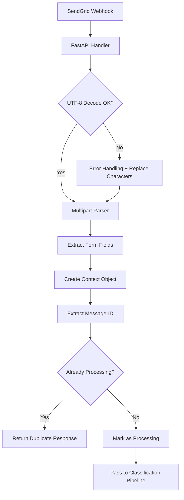

# Low-Level Design - Ingestion Pipeline

## Overview

The **Ingestion Pipeline** is the entry point for all email processing. It receives SendGrid webhooks, parses multipart form data, handles encoding issues, and creates standardized context objects for downstream processing.

## Components

### 1. FastAPI Server (`server.py`)

#### **Webhook Handler**
```python
@app.post("/webhook/inbound")
async def handle_inbound_email(request: Request)
```

**Responsibilities:**
- Receive POST requests from SendGrid webhook
- Handle UTF-8 encoding errors gracefully
- Parse raw request body
- Route to main orchestrator
- Return appropriate HTTP responses

**Error Handling:**
- `UnicodeDecodeError` → 400 Bad Request with encoding error details
- `Exception` → 500 Internal Server Error with error context

#### **Health Endpoints**
```python
@app.get("/")
@app.get("/health")
```

**Purpose:** Service health monitoring and basic status checks

### 2. Multipart Parser (`utils.py`)

#### **parse_multipart_form_data()**
```python
def parse_multipart_form_data(raw_body: bytes) -> dict
```

**Algorithm:**
1. Attempt UTF-8 decode with error handling
2. Extract boundary from content (default: `xYzZY`)
3. Split content by boundary markers
4. Parse each part for form field name and value
5. Return dictionary of parsed fields

**Error Resilience:**
- UTF-8 decode errors → Use replacement characters
- Missing boundaries → Use fallback parsing
- Malformed parts → Skip and continue processing

### 3. Context Object Creation (`main.py`)

#### **create_context_object()**
```python
def create_context_object(raw_payload: Dict[str, Any]) -> Dict[str, Any]
```

**Data Extraction:**
- **Email Content:** subject, text, from, to
- **Technical Fields:** sender_ip, SPF, DKIM, attachments
- **Headers:** Full email headers block
- **Metadata:** Processing timestamps, status tracking

**Output Structure:**
```json
{
  "subject": "Email subject line",
  "text": "Email body content",
  "from": "sender@domain.com",
  "to": "recipient@domain.com",
  "sender_ip": "192.168.1.1",
  "spf": "pass",
  "dkim": "pass",
  "attachments": "0",
  "headers": "Full email headers...",
  "received_timestamp": "2025-01-02T10:30:00Z",
  "processing_status": "received",
  "_raw_payload": { ... }
}
```

### 4. Deduplication Service (`utils.py`)

#### **Message-ID Extraction**
```python
def extract_message_id_from_headers(headers: str) -> str
```

**Process:**
1. Parse headers line by line
2. Find `Message-Id:` or `Message-ID:` header
3. Extract ID value after colon
4. Return unique identifier or "unknown"

#### **Duplicate Detection**
```python
def mark_email_as_processing(message_id: str) -> bool
```

**Race Condition Protection:**
- Immediate locking upon arrival
- In-memory set for processed Message-IDs
- Atomic check-and-set operation
- Returns `False` if already processing

**Storage:** In-memory set `_processed_message_ids`
- **Production Note:** Should be upgraded to Redis/Database for clustering

## Data Flow



## Error Handling Strategy

### **UTF-8 Encoding Errors**
- **Detection:** `UnicodeDecodeError` during decode
- **Recovery:** Use `errors='replace'` to substitute problematic bytes
- **Logging:** Log error position and continue processing
- **Response:** 400 Bad Request with encoding details

### **Parsing Errors**
- **Malformed Multipart:** Use best-effort parsing, skip corrupted parts
- **Missing Boundaries:** Use fallback boundary detection
- **Empty Content:** Create minimal fallback context object

### **Deduplication Failures**
- **Unknown Message-ID:** Allow processing (false negative safer than false positive)
- **Race Conditions:** First request wins, subsequent ignored
- **Memory Limits:** Monitor set size in production

## Performance Characteristics

### **Throughput**
- **Concurrent Requests:** Async FastAPI handles multiple simultaneous webhooks
- **Parser Performance:** O(n) linear parsing of multipart content
- **Deduplication:** O(1) constant time Message-ID lookup

### **Memory Usage**
- **Context Objects:** ~1-5KB per email (depending on content size)
- **Deduplication Set:** ~50 bytes per Message-ID
- **Raw Payload Storage:** Temporary during processing

### **Latency**
- **Parsing:** < 10ms for typical email content
- **Context Creation:** < 5ms for standard fields
- **Deduplication Check:** < 1ms for Message-ID lookup

## Configuration

### **Environment Variables**
```bash
# Server Configuration
HOST=0.0.0.0
PORT=8000
LOG_LEVEL=info

# SendGrid Webhook Security (optional)
SENDGRID_WEBHOOK_SECRET=your_webhook_secret
```

### **FastAPI Settings**
```python
app = FastAPI(
    title="HR Email Management System - Backend2",
    description="Email ingestion and processing pipeline",
    version="2.0.0"
)
```

## Monitoring & Logging

### **Key Metrics**
- Webhook requests per minute
- UTF-8 encoding error rate
- Duplicate email detection rate
- Average parsing time
- Context object creation success rate

### **Log Levels**
- **INFO:** Successful processing milestones
- **WARNING:** UTF-8 errors, duplicate detections
- **ERROR:** Parsing failures, critical errors
- **DEBUG:** Detailed field extraction, payload analysis

### **Sample Log Output**
```
2025-01-02 10:30:00 - INFO - 🚀 INCOMING EMAIL WEBHOOK!
2025-01-02 10:30:00 - INFO - 📅 Timestamp: 2025-01-02T10:30:00Z
2025-01-02 10:30:00 - INFO - 📏 Content Length: 2048 bytes
2025-01-02 10:30:00 - INFO - 📦 Parsed Fields: ['subject', 'text', 'from', 'to', 'headers']
2025-01-02 10:30:00 - INFO - 📧 Extracted Message-ID: <unique-id@sender.com>
2025-01-02 10:30:00 - INFO - ✅ Email is new and marked for processing
```

## Testing Strategy

### **Unit Tests**
- UTF-8 encoding error scenarios
- Multipart parsing with various boundary formats
- Context object creation with missing fields
- Message-ID extraction from different header formats

### **Integration Tests**
- End-to-end webhook processing
- Concurrent request handling
- Duplicate detection across multiple requests

### **Load Tests**
- High-volume webhook processing
- Memory usage under sustained load
- Response time under concurrent load

## Security Considerations

### **Input Validation**
- Size limits on webhook payload (prevent DoS)
- Header injection prevention
- Malformed multipart content handling

### **Rate Limiting**
- Per-IP request limits (if needed)
- SendGrid webhook authentication
- Resource consumption monitoring

### **Data Privacy**
- Email content handling in compliance with GDPR
- Minimal data retention in logs
- Secure transmission (HTTPS only) 