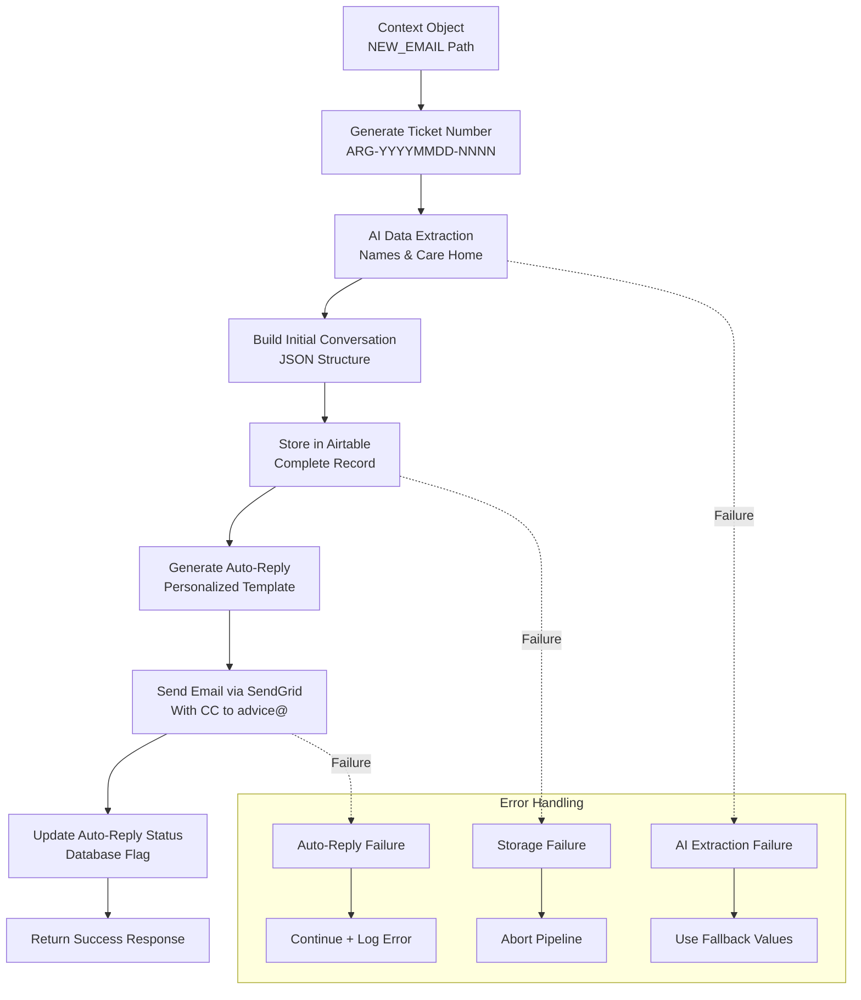

# Low-Level Design - New Email Pipeline

## Overview

The **New Email Pipeline** processes first-time customer inquiries that don't contain existing ticket numbers. It generates unique tickets, extracts customer information using AI, stores data in Airtable, and sends personalized auto-reply acknowledgments.

## Pipeline Flow



## Core Components

### 1. Ticket Number Generation (`utils.py`)

#### **generate_ticket_number()**
```python
def generate_ticket_number() -> str:
    today = datetime.now().strftime("%Y%m%d")
    # Query Airtable for highest sequence number today
    # Increment by 1 for new ticket
    # Format: ARG-YYYYMMDD-NNNN
```

**Algorithm:**
1. Get current date in YYYYMMDD format
2. Query Airtable for all tickets with today's date pattern
3. Extract sequence numbers and find maximum
4. Increment by 1 for new ticket
5. Format as `ARG-YYYYMMDD-{sequence:04d}`
6. Validate uniqueness before returning

**Collision Prevention:**
- Database-validated sequential numbering
- Microsecond fallback for high-concurrency scenarios
- Paranoid validation with existence checks

#### **Ticket Format Examples**
```
ARG-20250603-0001  # First ticket of the day
ARG-20250603-0002  # Second ticket
ARG-20250603-0156  # 156th ticket of the day
```

### 2. AI Data Extraction (`database.py`)

#### **SenderNameExtractor**
```python
class SenderNameExtractor:
    def extract_sender_name(self, email_content: str) -> SenderNameExtractionResponse
```

**Extraction Logic:**
- **Signature Detection:** "Best regards,", "Sincerely,", "Thanks," patterns
- **Name Splitting:** First name / last name component separation
- **Confidence Scoring:** 1.0 for clear signatures, 0.8 for probable names
- **Fallback Strategy:** Email username if no name found

#### **CareHomeNameExtractor**
```python
class CareHomeNameExtractor:
    def extract_care_home_name(self, email_content: str) -> CareHomeNameExtractionResponse
```

**Detection Strategy:**
- **Content Analysis:** Message body for care home mentions
- **Signature Analysis:** Email signatures for workplace indicators
- **Pattern Recognition:** "...Care Home", "...Residential", "...Nursing Home"

### 3. Data Structure Assembly (`database.py`)

#### **extract_email_data_from_context()**
```python
def extract_email_data_from_context(context_object: Dict[str, Any]) -> Dict[str, Any]
```

**Field Extraction:**
```python
extracted_data = {
    # Ticket tracking
    'ticket_number': context_object.get('ticket_number', ''),
    'status': 'new',
    'created_at': context_object.get('received_timestamp', datetime.utcnow().isoformat()),
    
    # Email content
    'subject': context_object.get('subject', ''),
    'email_body': extract_email_body(context_object),
    'original_sender': extract_original_sender(context_object),
    
    # AI-extracted fields
    'sender_first_name': '',  # Populated by AI
    'sender_last_name': '',   # Populated by AI
    'care_home_name': '',     # Populated by AI
    
    # Conversation structure
    'initial_conversation_query': '',  # JSON conversation entry
    'conversation_history': '[]'       # Empty for new emails
}
```

#### **build_initial_conversation_query()**
```python
def build_initial_conversation_query(context_object: Dict[str, Any]) -> tuple[str, str, str, str]
```

**Conversation Entry Structure:**
```json
{
  "sender_email": "customer@company.com",
  "sender_email_date": "03/06/2025 17:37 BST",
  "sender_content": "Hi, I need help with HR policy...",
  "sender_name": "John Smith",
  "care_home_name": "Sunrise Care Home"
}
```

### 4. Database Storage (`database.py`)

#### **store_new_email()**
```python
def store_new_email(email_data: Dict[str, Any]) -> bool
```

**Airtable Record Format:**
```python
airtable_record = {
    "ticket_number": "ARG-20250603-0001",
    "status": "new",
    "created_at": "2025-06-03T17:37:00Z",
    "subject": "HR Policy Question",
    "email_body": "Hi, I need help with...",
    "original_sender": "customer@company.com",
    "sender_first_name": "John",
    "sender_last_name": "Smith",
    "care_home_name": "Sunrise Care Home",
    "initial_conversation_query": "{...}",  # JSON string
    "conversation_history": "[]",
    "initial_auto_reply_sent": False,  # Updated after auto-reply
    "has_attachments": False,
    "attachment_count": 0,
    "spf_result": "pass",
    "dkim_result": "pass"
}
```

### 5. Auto-Reply Generation (`auto_reply_templates.py`)

#### **AutoReplyTemplateGenerator**
```python
class AutoReplyTemplateGenerator:
    def generate_auto_reply_content(
        self,
        sender_first_name: str,
        original_subject: str,
        original_query: str,
        ticket_number: str,
        priority: str = "Normal"
    ) -> Dict[str, str]
```

**Template Structure:**
- **Personalized Greeting:** "Hi {first_name}" or "Hello" fallback
- **Ticket Number:** Clear ticket reference for future correspondence
- **Original Query:** Full customer message for reference
- **Response Timeframes:** Priority-based SLA communication
- **Professional Formatting:** Both text and HTML versions

#### **Sample Auto-Reply Output**
```
Subject: [ARG-20250603-0001] Argan HR Consultancy - Call Logged

Hi John,

Thank you for contacting Argan HR Consultancy. We have received your enquiry 
and assigned it ticket number ARG-20250603-0001.

┌─────────────────────────────────────────────────────────────────┐
│ Original Subject: HR Policy Question                           │
│ Priority: Normal                                               │
│ Ticket Number: ARG-20250603-0001                              │
└─────────────────────────────────────────────────────────────────┘

We will review your request and respond within our standard timeframe:
• Urgent matters: Within 4 hours
• High priority: Within 24 hours  
• Normal requests: Within 2-3 business days

Original Enquiry (for reference):
    Hi, I need help with HR policy regarding staff breaks...

Best regards,
Argan HR Consultancy Team
```

### 6. Email Delivery (`email_service.py`)

#### **EmailService.send_auto_reply_email()**
```python
async def send_auto_reply_email(
    self, 
    to_email: str,
    subject: str,
    text_content: str,
    html_content: str = None,
    ticket_number: str = None,
    cc_addresses: List[str] = None
) -> Dict[str, Any]
```

**SendGrid API Payload:**
```python
payload = {
    "personalizations": [{
        "to": [{"email": "customer@company.com"}],
        "cc": [{"email": "advice@arganhrconsultancy.co.uk"}]  # CC for visibility
    }],
    "from": {
        "email": "email@email.adaptixinnovation.co.uk",
        "name": "Argan HR Consultancy"
    },
    "reply_to": {
        "email": "customer@company.com"  # Reply goes back to customer
    },
    "subject": "[ARG-20250603-0001] Argan HR Consultancy - Call Logged",
    "content": [
        {"type": "text/plain", "value": text_content},
        {"type": "text/html", "value": html_content}
    ]
}
```

**Retry Logic:**
- 3 attempts with exponential backoff (2s, 4s, 6s delays)
- Initial 0.5s delay to prevent connection conflicts
- Graceful degradation on persistent failures

## Data Flow Details

### **Input Processing**
```python
# From Classification Pipeline
context_object = {
    "subject": "HR Policy Question",
    "text": "Hi, I need help with staff break policies...",
    "from": "John Smith <jsmith@sunrisecare.com>",
    "to": "advice@arganhrconsultancy.co.uk",
    "headers": "From: John Smith <jsmith@sunrisecare.com>\nDate: ...",
    // ... technical fields
}
```

### **Processing Steps**

#### **Step 1: Ticket Generation**
```python
ticket_number = generate_ticket_number()  # "ARG-20250603-0001"
context_object['ticket_number'] = ticket_number
context_object['processing_status'] = 'ticket_generated'
```

#### **Step 2: AI Data Extraction**
```python
# Extract sender name components
name_result = name_extractor.extract_sender_name(email_content)
sender_first_name = name_result.sender_first_name or ""
sender_last_name = name_result.sender_last_name or ""

# Extract care home name
care_home_result = care_home_extractor.extract_care_home_name(email_content)
care_home_name = care_home_result.care_home_name or ""
```

#### **Step 3: Database Storage**
```python
email_data = extract_email_data_from_context(context_object)
airtable_success = store_new_email(email_data)

if not airtable_success:
    return {"success": False, "error": "Failed to store email in Airtable"}
```

#### **Step 4: Auto-Reply Generation & Delivery**
```python
auto_reply_content = template_generator.generate_auto_reply_content(
    sender_first_name=sender_first_name,
    original_subject=email_data['subject'],
    original_query=email_content,
    ticket_number=ticket_number
)

auto_reply_result = await email_service.send_auto_reply_email(
    to_email=original_sender,
    subject=auto_reply_content['subject'],
    text_content=auto_reply_content['text_body'],
    html_content=auto_reply_content['html_body'],
    cc_addresses=["advice@arganhrconsultancy.co.uk"]
)
```

#### **Step 5: Status Updates**
```python
if auto_reply_result['success']:
    update_auto_reply_status(ticket_number, True)
    context_object['auto_reply_status'] = 'sent'
else:
    context_object['auto_reply_status'] = 'failed'
```

## Error Handling

### **Critical Path Failures**

#### **Ticket Generation Failure**
```python
# Fallback to microsecond-based numbering
fallback_ticket = f"ARG-{today}-{microseconds:04d}"
```

#### **Database Storage Failure**
```python
# Abort processing - don't send auto-reply if storage failed
return {
    "success": False,
    "error": "Failed to store email in Airtable",
    "message": "New email processing failed at storage step"
}
```

### **Non-Critical Failures**

#### **AI Extraction Failure**
```python
# Use fallback values
sender_name = original_sender.split('@')[0]  # Email username
care_home_name = ""  # Empty if not detected
```

#### **Auto-Reply Failure**
```python
# Continue processing but log error
context_object['auto_reply_status'] = 'failed'
context_object['auto_reply_error'] = str(error)
# Still return success since ticket was created
```

## Performance Metrics

### **Processing Time**
- **Ticket Generation:** 200-500ms (database query dependent)
- **AI Extraction:** 2-4 seconds (OpenAI API dependent)
- **Database Storage:** 300-800ms (Airtable API dependent)
- **Auto-Reply Generation:** 100-200ms (template processing)
- **Email Delivery:** 500-1500ms (SendGrid API dependent)
- **Total Pipeline:** 4-8 seconds typical

### **Success Rates**
- **Ticket Generation:** >99.9% (with fallback mechanisms)
- **Database Storage:** >99% (Airtable reliability)
- **AI Extraction:** >95% (fallback to email parsing)
- **Auto-Reply Delivery:** >98% (SendGrid reliability)

### **Throughput**
- **Concurrent Processing:** 10-50 simultaneous new emails
- **Daily Volume:** 1000+ new tickets supported
- **Rate Limiting:** Governed by external API limits

## Configuration

### **Environment Variables**
```bash
# Database Configuration
AIRTABLE_API_KEY=pat_your_api_key
AIRTABLE_BASE_ID=app_your_base_id

# Email Configuration  
SENDGRID_API_KEY=SG.your_api_key
FROM_EMAIL=email@email.adaptixinnovation.co.uk

# AI Configuration
OPENAI_API_KEY=sk-your_api_key

# Processing Settings
AUTO_REPLY_CC_ADDRESSES=advice@arganhrconsultancy.co.uk
DEFAULT_PRIORITY=Normal
TICKET_PREFIX=ARG
```

### **Operational Settings**
```python
# Retry configurations
MAX_RETRIES = 3
BASE_DELAY = 2  # seconds
INITIAL_DELAY = 0.5  # seconds

# Template settings
COMPANY_NAME = "Argan HR Consultancy"
TEAM_NAME = "Argan HR Consultancy Team"
```

## Monitoring & Alerting

### **Key Metrics**
- New ticket creation rate
- AI extraction success rate
- Auto-reply delivery success rate
- Average pipeline processing time
- Database storage failure rate

### **Alert Conditions**
- Database storage failure rate >1%
- Auto-reply failure rate >5%
- AI extraction completely failing
- Ticket generation failures
- Processing time >30 seconds

### **Logging Events**
```python
logger.info("🆕 [NEW EMAIL PATH] Starting new email processing")
logger.info(f"🎫 [NEW EMAIL PATH] Generated ticket: {ticket_number}")
logger.info("💾 [NEW EMAIL PATH] Email stored in Airtable successfully")
logger.info("📤 [NEW EMAIL PATH] Auto-reply sent successfully")
logger.info("✅ [NEW EMAIL PATH] Processing complete")
``` 